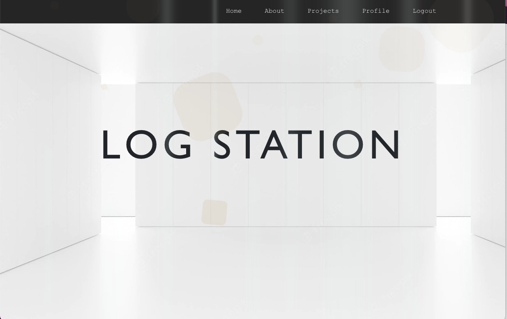
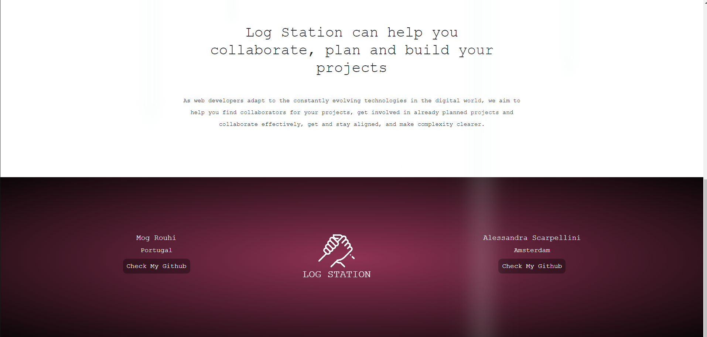
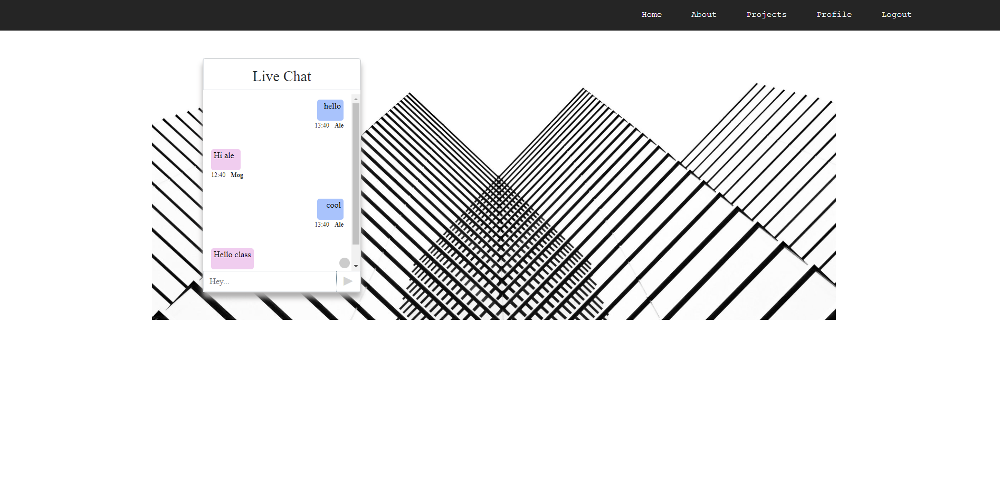

# LOG STATION

Log Station is a platform for web developers who want to: 
- show projects they developed
- share projects they are working on
- present ideas of projects they'd like to develop
- CONTACT OTHER DEVELOPERS THEY'D LIKE TO COLLABORATE WITH!

## Installation

This project was bootstrapped with Create React App!


```bash
npm install
```

## Other npm packages

```python
# Axios for API's requests
npm install axios

# React Router DOM
npm i react-router-dom

# Live-chat Websocket
npm i socket.io-client

# Styled with Bootstrap
npm i bootstrap

# Loading spinners
npm i react-spinners

# Implement scroll bar for the chat
npm i react-scroll-to-bottom
```

## Environmental variable

REACT_APP_API_URL --> API server

REACT_APP_WS_SERVER --> Web socket server


## Back-end  
 
Backend repository --> [log-station-server](https://github.com/italian-iranian-connection/log-station-server)

Server on --> [fly.io](https://log-station.fly.dev/)

## Visit the website!
[GO!](https://logstation.netlify.app)




